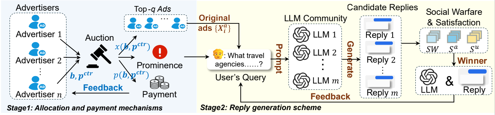

# MAE-AM

This repository contains the official implementation of the **MAE-AM** system, as described in the paper **"MAE-AM: Query-driven Multi-Advertisement Embeddings and Auction Mechanism in LLM"**, submitted to **IJCAI 2025**.

## Introduction

**MAE-AM** is a query-driven Multi-Advertisement Embedding and Auction Mechanism designed for Large Language Models (LLMs). The system introduces a **multi-advertisement auction mechanism** to:

1. Efficiently allocate the word-length budget for advertisements.
2. Seamlessly embed advertisement content into generated replies, preserving contextual coherence.



This system demonstrates its capability to balance query relevance and advertisement utility, making it a significant contribution to the field of intelligent advertisement systems powered by LLMs.

## File Structure

```
MAE-AM/
├── auction/                    # Auction mechanism implementations
├── cfgs/                       # Configuration files
├── dataset/                    # Dataset files
├── LLMs/                       # Large Language Model utilities
├── model_zoo/                  # Pretrained models and weights
├── plot/                       # Visualization scripts
├── run_ADGEN/                  # Scripts for ADGEN experiments
├── run_ATVI/                   # Scripts for ATVI experiments
├── utils/                      # Utility scripts
└── README.md                   # Project documentation
```

## API Key Notice
For privacy reasons, all API keys required for LLM-related operations have been omitted from the code. To run the code, you must obtain or purchase API keys from your chosen LLM provider and manually add them to the appropriate configuration files or scripts.

## Datasets

* **ADGEN**: is a Chinese advertising dataset generated by models utilizing web tags and advertising copy. This dataset focuses on advertising content generation and primarily includes three product categories: shirts, skirts, and pants. Each sample contains detailed content descriptions of the associated product.
* **ATVI**: is an English dataset comprising approximately 2,000 authentic business advertising scripts. It en compasses 26 different industries, including automotive, healthcare, and tourism, and others.

## Citation

If you find this work useful, please cite us:

```
@inproceedings{maeam2025,
  title={MAE-AM: Query-driven Multi-Advertisement Embeddings and Auction Mechanism in LLM},
  author={Anonymous authors},
  booktitle={Proceedings of the 34th International Joint Conference on Artificial Intelligence (IJCAI)},
  year={2025}
}
```
